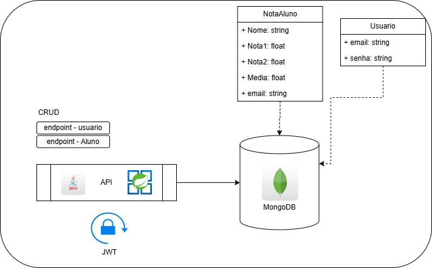

# UserEAluno

Projeto com base no projeto feito pelo [aannddrree](https://github.com/aannddrree/exemplo-jwt-08052025) no dia 08/05/2003 usando o JSON Web Token como controle de usuário para a validação de Tokens dessa forma permitindo que o controle do Banco de Dados seja feito apenas por usuários autenticados.

# Arquitetura

A arquitetura contem 2 classes, no caso Aluno e Usuário, onde os usuários podem se cadastrar e efetuar login, e ao efetuar o login você pode usar os tokens para fazer as operações em CRUD no Nota Aluno.

